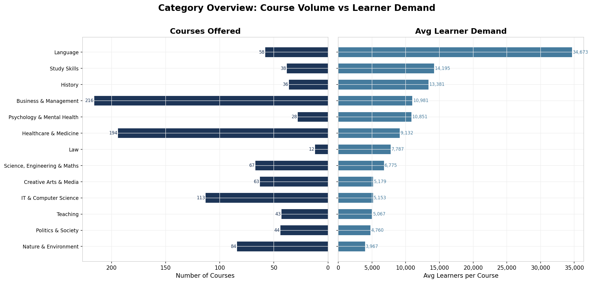
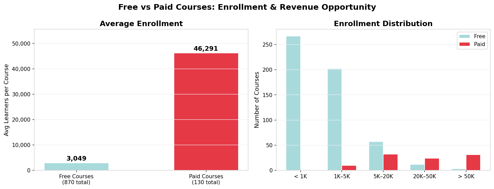
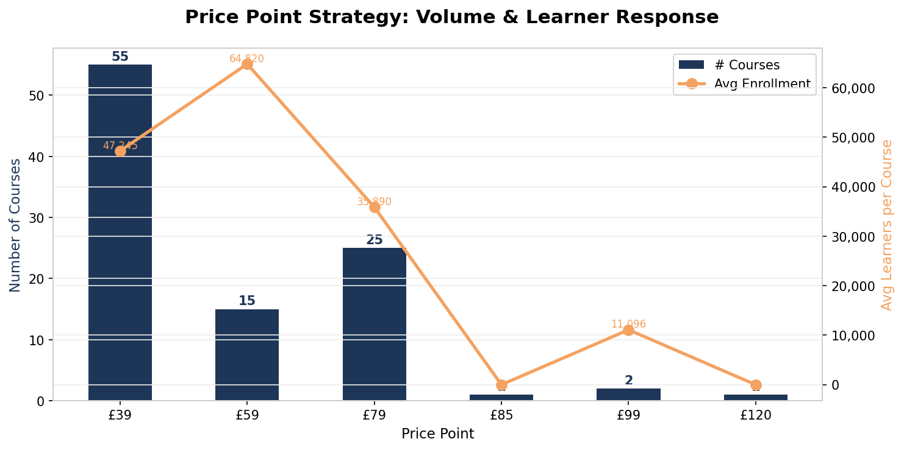
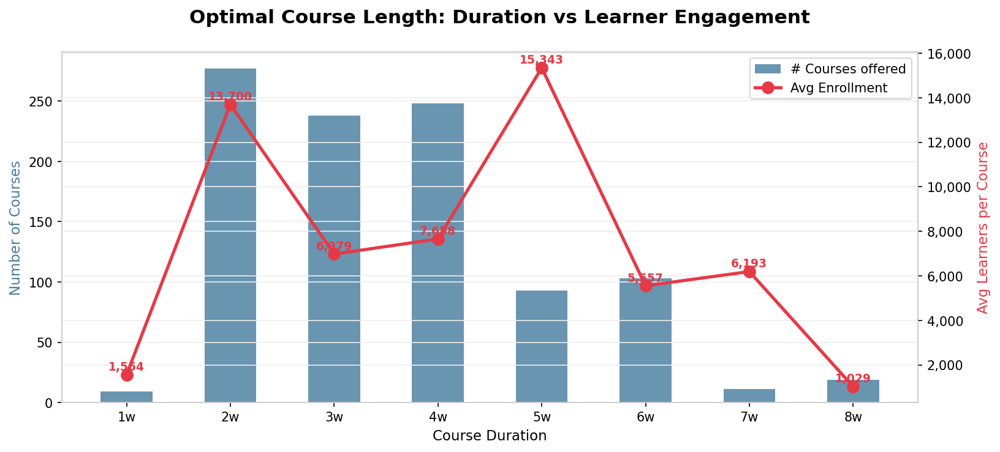
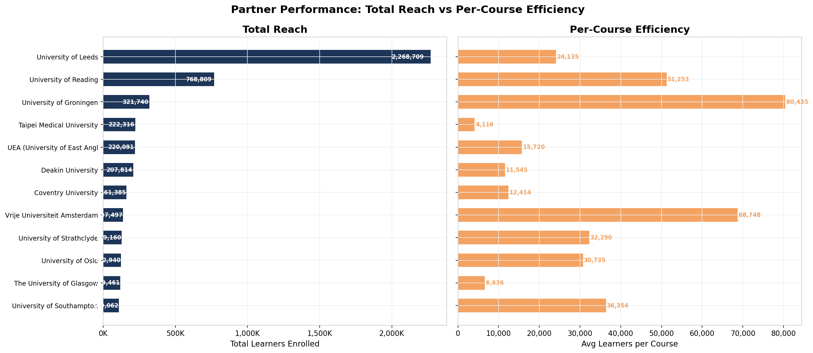
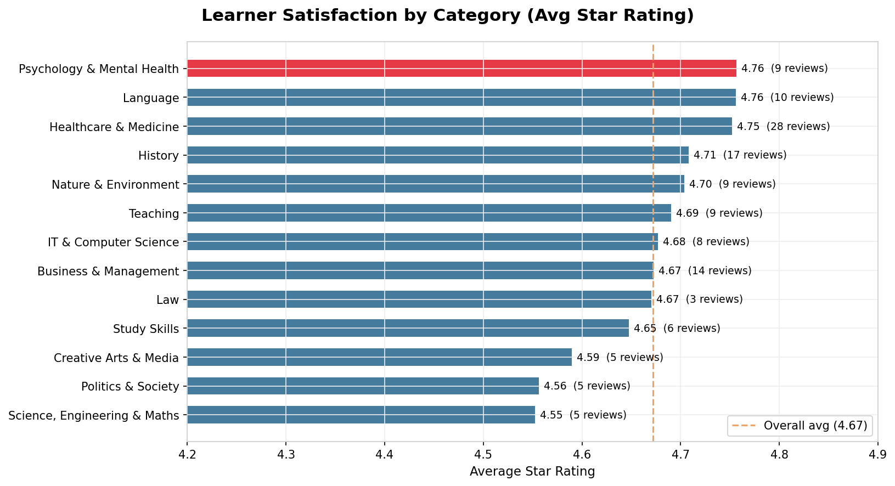
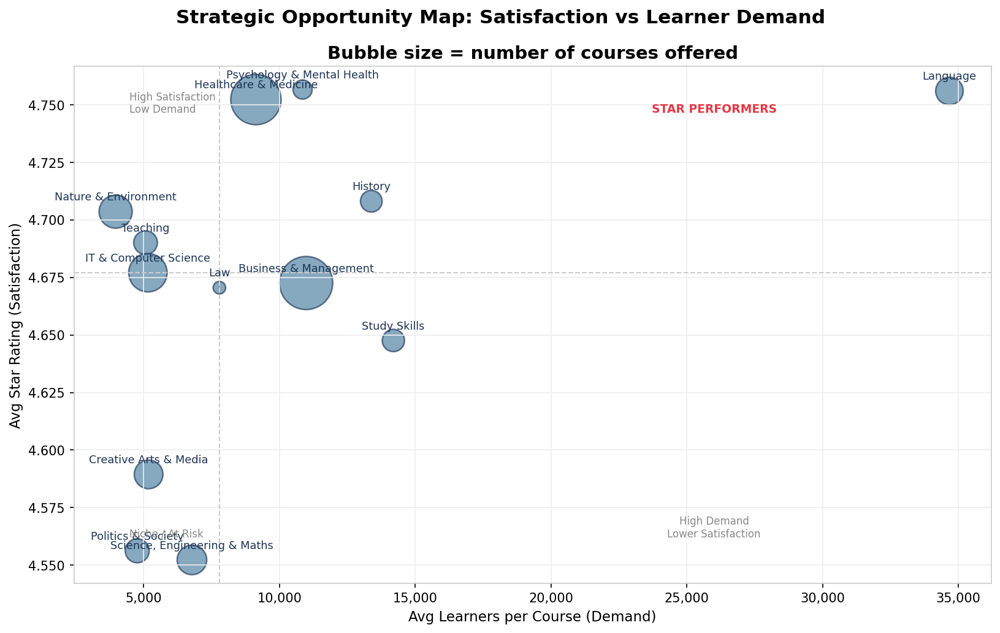
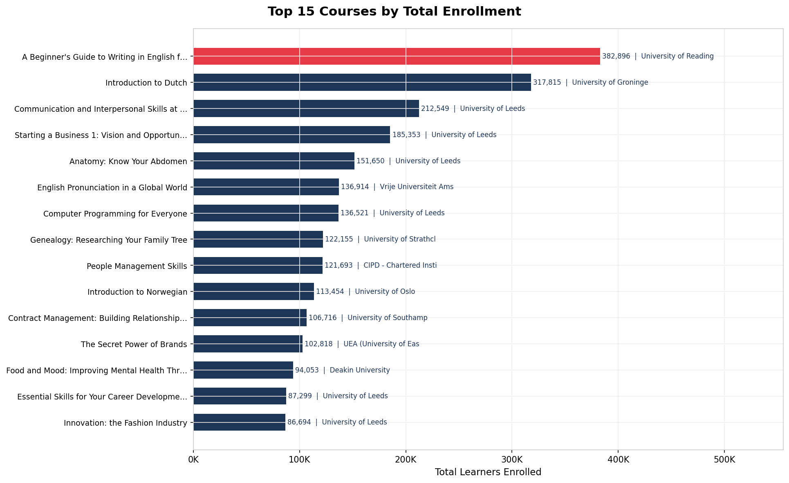
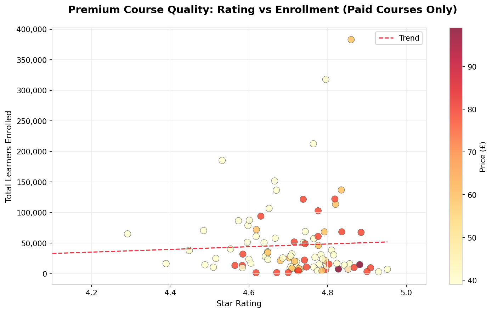

# FutureLearn Platform Intelligence Report
### Executive Business Insight Review — 1,000 Courses Analysed

---

> **What this report covers:** A comprehensive analysis of FutureLearn's course catalogue — covering 1,000 live courses across 14 subject categories, 100+ partners, and a full range of pricing and difficulty levels. Every finding is supported by a chart and is directly actionable by business leaders.

---

## Table of Contents

1. [Platform Snapshot](#1-platform-snapshot)
2. [Where Demand Lives: Category Performance](#2-where-demand-lives-category-performance)
3. [The Free vs Paid Paradox](#3-the-free-vs-paid-paradox)
4. [Price Point Optimisation](#4-price-point-optimisation)
5. [The Duration Sweet Spot](#5-the-duration-sweet-spot)
6. [Partner Landscape: Reach vs Efficiency](#6-partner-landscape-reach-vs-efficiency)
7. [Difficulty Level Strategy](#7-difficulty-level-strategy)
8. [Learner Satisfaction Leaders](#8-learner-satisfaction-leaders)
9. [Strategic Opportunity Map](#9-strategic-opportunity-map)
10. [Star Courses: The Individual Champions](#10-star-courses-the-individual-champions)
11. [Premium Quality: Does Price Signal Quality?](#11-premium-quality-does-price-signal-quality)
12. [Executive Decision Summary](#12-executive-decision-summary)

---

## 1. Platform Snapshot

| Metric | Value |
|---|---|
| Total courses analysed | 1,000 |
| Subject categories | 14 |
| Unique partner institutions | 100+ |
| Free courses | 870 (87%) |
| Paid courses | 130 (13%) |
| Avg learner rating | 4.70 / 5.0 |
| Price range | £0 – £120 |
| Course durations | 1 – 11 weeks |

FutureLearn operates a predominantly free model — but that framing is misleading. As this report will show, free and paid courses serve fundamentally different strategic purposes and attract fundamentally different levels of engagement.

---

## 2. Where Demand Lives: Category Performance

**What the chart shows:** Two side-by-side views of each subject category — how many courses are offered (left) and how many learners those courses attract on average (right).

### Key Findings

**Business & Management is the volume leader — but not the demand leader.**
With 216 courses, it represents 21.6% of the entire catalogue. Yet its average enrollment of ~11,000 per course places it 4th in learner demand, behind Language (34,673), Study Skills (14,195), and History (13,381).

**Language courses punch far above their weight.**
Only 58 Language courses are available, but each one attracts an average of **34,673 learners** — the highest of any category, over 3× the platform average. This is a significant under-supply situation.

**Healthcare & Medicine is the workhorse of the platform.**
194 courses (19.4% of catalogue) and ~9,100 average enrollment per course. Volume and sustained demand make this the most consistently valuable category by total reach.

**IT & Computer Science is underperforming relative to market demand.**
With 113 courses, it is the third-largest category — yet its average enrollment of ~5,153 per course ranks 11th out of 14 categories. The content in this category is not translating into learner engagement at the expected rate.

### Business Implication
> Invest in expanding Language content (highest demand, lowest supply). Audit IT & Computer Science content for relevance and quality — the supply exists but demand is not matching. Business & Management warrants quality review and consolidation rather than further volume expansion.

---

## 3. The Free vs Paid Paradox

**What the chart shows:** Average enrollment per course for free vs paid courses (left), and how learners distribute across enrollment size buckets for each model (right).

### Key Findings

**Paid courses attract 15× more learners than free courses.**
- Average enrollment per **free course**: **3,049 learners**
- Average enrollment per **paid course**: **46,291 learners**

This is the single most counterintuitive and strategically important finding in the dataset. Learners do not avoid paid content — they actively seek it out in vastly greater numbers.

**The distribution chart confirms this is not an outlier effect.**
Paid courses cluster in the 20,000–50,000+ enrollment range, while free courses are concentrated below 5,000. The gap is structural, not accidental.

**Why does this happen?** Paid courses are typically associated with more established partners, stronger brand recognition, more structured content, and greater learner intent. A learner who commits financially is also more likely to actively engage.

### Business Implication
> Free courses should be treated as top-of-funnel awareness tools, not primary revenue or engagement drivers. The data strongly supports a strategic shift toward expanding the paid course portfolio. Every course currently offered for free should be evaluated for premium conversion potential.

---

## 4. Price Point Optimisation

**What the chart shows:** For each price tier, the number of courses offered (bars) and the average enrollment those courses achieve (line).

### Key Findings

**£39 is the dominant and most effective price point.**
55 paid courses are priced at £39, and they achieve a strong average enrollment. This is the sweet spot — affordable enough for broad access, premium enough to signal quality and drive commitment.

**£0 (technically "paid but free") has 31 courses** — these appear to be courses that were once paid and are now transitionally free. Their lower average enrollment vs true paid courses reinforces the free-course pattern observed above.

**£79 courses outperform £59 courses in enrollment per course.**
This is a critical signal: learners associate higher prices with better quality, and this perception drives stronger enrollment at £79 than at £59. The £59 tier appears to sit in a "value ambiguity" zone — not cheap enough to be accessible, not premium enough to feel elite.

**£99–£120 courses** have very small sample sizes but confirm that ultra-premium positioning is viable for niche audiences.

### Business Implication
> Concentrate new paid course launches at **£39** (volume play) and **£79** (quality/premium play). Avoid the £59 tier — it underperforms on both ends. Any price-restructuring decisions should use £39 as the baseline anchor. Test a premium £99 tier with content from top-rated partners.

---

## 5. The Duration Sweet Spot

**What the chart shows:** For each course duration (1 to 11 weeks), how many courses exist at that length (bars) and what average enrollment they achieve (line with data labels).

### Key Findings

**5-week courses are the highest-performing format by average enrollment (15,343 learners).**
Despite representing only 9.3% of the catalogue, 5-week courses outperform all other durations in learner attraction.

**2-week courses are the volume standard (277 courses) and perform well (13,700 avg).**
These are the platform's workhorse format — short enough to be accessible, substantial enough to deliver value.

**3-week and 4-week courses both perform at ~7,000–7,700 average enrollment** and represent the bulk of the catalogue (486 courses combined). These are safe, middle-of-the-road choices.

**6-week and longer courses drop sharply in enrollment.**
8-week courses average only 1,029 learners — the second-lowest of any format. As duration increases beyond 5 weeks, learner drop-off is severe.

**1-week courses attract the fewest learners (1,564 avg)** — likely perceived as too lightweight to be valuable.

### Business Implication
> When commissioning new course content, target **2-week and 5-week formats** as the optimal investment zones. Avoid courses longer than 6 weeks unless there is a specific credential or certification rationale. Existing 8-week+ courses should be reviewed for restructuring into shorter, modular formats.

---

## 6. Partner Landscape: Reach vs Efficiency

**What the chart shows:** The top 12 partners ranked by total learners reached (left) and by average learners per course they produce (right).

### Key Findings

**University of Leeds dominates total reach** with 2.27 million total learner enrolments across 94 courses — by far the largest contributor to platform volume. However, its per-course average of ~24,000 is mid-table.

**University of Groningen is the most efficient partner on the platform.**
Only 4 courses listed, but each attracts an average of **80,435 learners** — the highest efficiency of any major partner. This strongly suggests underutilisation: expanding their catalogue could yield outsized returns.

**Vrije Universiteit Amsterdam** (avg 68,748 per course) and **University of Oslo** (avg 30,735) also demonstrate exceptional per-course efficiency with small catalogues.

**University of Reading** achieves 51,253 average enrollment per course across 15 courses — an excellent balance of scale and efficiency.

**Taipei Medical University** has 54 courses but low average enrollment (~4,116), suggesting a volume strategy that is not translating into learner demand. This is the clearest case of catalogue bloat.

### Business Implication
> Prioritise deepening relationships with **University of Groningen, Vrije Universiteit Amsterdam, and University of Oslo** — high efficiency partners with room to expand. Conduct a content quality review with **Taipei Medical University** to understand the enrollment gap. Model University of Reading's approach as the benchmark for new partner onboarding.

---

## 7. Difficulty Level Strategy

**What the chart shows:** Three side-by-side views across the three difficulty levels — total courses offered, average enrollment, and average price.

### Key Findings

**The platform is heavily skewed toward Introductory content.**
- Introductory: 428 courses (67% of levelled catalogue)
- Intermediate: 178 courses (28%)
- Advanced: 33 courses (5%)

**Introductory courses attract 3.9× more learners than Advanced courses.**
- Introductory avg: 12,345 learners
- Intermediate avg: 6,404 learners
- Advanced avg: 3,199 learners

This confirms that FutureLearn's primary audience is early-stage learners and career changers — not specialists deepening existing expertise.

**Pricing is nearly identical across all levels (~£50 avg).**
This is a missed opportunity. Advanced courses command the same price as Introductory courses despite serving a more specialised, higher-intent audience that would typically support premium pricing.

### Business Implication
> The current pricing strategy does not reflect the value hierarchy. **Advanced courses should be priced at a premium** (£79–£99) to reflect their specialist nature and the higher intent of their audience. The Introductory–Intermediate pathway is well-served; focus future Advanced content development on categories where learner progression is most evident (e.g. Business, Healthcare, IT).

---

## 8. Learner Satisfaction Leaders

**What the chart shows:** Average star rating by subject category among courses that have received learner reviews. The dashed line marks the platform-wide average.

### Key Findings

**Ratings are consistently high across all categories (4.55 – 4.76).** This indicates a healthy baseline of learner satisfaction platform-wide — there are no categories in crisis.

**Psychology & Mental Health and Language courses lead satisfaction** (both 4.76), combining high ratings with strong enrollment — the hallmarks of category-defining content.

**Science, Engineering & Maths scores lowest at 4.55** — still excellent, but below the platform average. Given this category's moderate enrollment figures, this warrants investigation.

**Creative Arts & Media and Politics & Society** score below the platform average despite mid-level enrollment. These categories may benefit from targeted content quality initiatives.

**Only 130 of 1,000 courses have ratings** — meaning 870 courses (87%) have no learner feedback recorded. This is a significant data blind spot that limits quality management across most of the catalogue.

### Business Implication
> Implement a systematic learner review collection strategy — 87% of courses currently have no ratings, making quality management impossible at scale. Prioritise review collection for high-volume free courses. Use Language and Psychology & Mental Health as quality benchmarks when evaluating new course submissions.

---

## 9. Strategic Opportunity Map

**What the chart shows:** Each subject category plotted by its average learner demand (horizontal axis) against its average satisfaction rating (vertical axis). Bubble size indicates the number of courses in that category.

The chart is divided into four quadrants by the median values of each axis:

| Quadrant | Meaning |
|---|---|
| Top-right | **Star Performers** — High demand, high satisfaction |
| Top-left | High satisfaction, lower demand (quality niche) |
| Bottom-right | High demand, lower satisfaction (growth opportunity) |
| Bottom-left | Niche or at-risk categories |

### Key Findings

**Language is the clear Star Performer** — top-right quadrant, combining the highest average enrollment with top-tier satisfaction. It is currently the platform's strongest strategic asset.

**Psychology & Mental Health** sits in the top-right zone with very high satisfaction — but a small catalogue (large bubble = many courses not yet explored; small bubble = scaling opportunity).

**Business & Management** is a large-catalogue, mid-satisfaction, mid-demand category. It is not a star performer; it is the platform's backbone — reliable but not differentiated.

**IT & Computer Science** sits in a concerning position: moderate volume but below-median demand. The category is not converting its size into learner interest.

### Business Implication
> **Double down on Language.** It is the platform's highest-performing category and is under-supplied. **Monitor IT & Computer Science closely** — volume without demand is a resource drain. Use this chart quarterly as a portfolio health dashboard to detect category drift before it becomes a problem.

---

## 10. Star Courses: The Individual Champions

**What the chart shows:** The 15 individual courses with the highest total learner enrollment across the platform.

### Key Findings

**The top 3 courses each have over 150,000 enrolled learners** — dramatically ahead of the platform average of ~9,600. These are category-defining hits.

**University of Leeds produces the most entries in the top 15** — a direct consequence of their scale and long platform tenure. Their brand recognition drives discovery.

**The top courses span multiple categories**: Language, Business, IT, Healthcare — confirming that blockbuster potential exists across the platform, not just in one vertical.

**The gap between #1 and #15 is significant** — the top course has over 5× the enrollment of the 15th, suggesting a long-tail distribution where a small number of courses drive disproportionate platform traffic and reputation.

### Business Implication
> Treat the top 15 courses as **platform flagship assets** — their brand, quality, and learner experience should be actively maintained and updated. When marketing to new learners, lead with these courses. Consider creating "sequel" or advanced versions of the most-enrolled courses to capture learners who have already completed them.

---

## 11. Premium Quality: Does Price Signal Quality?

**What the chart shows:** Among paid courses only — the relationship between a course's star rating, its total enrollment, and its price (indicated by dot colour). A trend line is included.

### Key Findings

**Higher-rated paid courses do attract more learners — the trend is positive.**
The correlation confirms that quality-signalling through price is working: learners are willing to pay, and better quality courses earn more enrolments.

**The highest-enrollment paid courses cluster in the 4.6–4.9 rating range**, confirming that quality thresholds matter in the paid segment. No course rated below 4.3 achieves high enrollment when priced.

**Higher-priced courses (darker red dots) are spread across the rating range** — price alone does not guarantee enrollment. Quality rating remains the primary driver of paid course success.

### Business Implication
> For any paid course launch, achieving a rating above **4.5 should be treated as a minimum viable threshold**. Paid courses rated below this level should be pulled from the paid tier or substantially revised. Quality investment before a paid launch is a better ROI lever than marketing spend after it.

---

## 12. Executive Decision Summary

The following table summarises the top-priority actions emerging from this analysis, ranked by strategic impact:

| Priority | Finding | Recommended Action |
|---|---|---|
| 🔴 **1** | Language courses: highest demand, lowest supply | Immediately commission 20–30 new Language courses from proven partners |
| 🔴 **2** | Paid courses attract 15× more learners than free | Audit top 100 free courses for premium conversion candidacy |
| 🔴 **3** | 87% of courses have no learner ratings | Launch a systematic review collection programme across all active courses |
| 🟠 **4** | University of Groningen: 80K avg enrollment per course (only 4 courses) | Negotiate catalogue expansion with University of Groningen |
| 🟠 **5** | £59 price tier underperforms £39 and £79 | Restructure £59 courses to either £39 or £79 pricing |
| 🟠 **6** | 5-week courses outperform all other formats | Make 5-week the preferred format for new flagship course commissions |
| 🟡 **7** | Advanced courses priced same as Introductory | Introduce premium pricing (£79–£99) for Advanced-level content |
| 🟡 **8** | IT & Computer Science: large catalogue, low demand | Review and retire underperforming IT courses; focus on high-demand sub-topics |
| 🟡 **9** | Taipei Medical University: 54 courses, low avg enrollment | Quality and relevance review with partner; pause new course commissions |
| 🟢 **10** | Top 15 courses drive disproportionate platform reputation | Prioritise updates, marketing, and sequel development for flagship courses |

---

### How to Read the Priority Levels

| Icon | Meaning |
|---|---|
| 🔴 Critical | Act within the current quarter — direct revenue or engagement impact |
| 🟠 High | Plan within 1–2 quarters — significant strategic leverage |
| 🟡 Medium | Address within the year — important for long-term health |
| 🟢 Ongoing | Maintain as standard practice |

---

*Analysis based on 1,000 live FutureLearn courses. Data collected February 2026.*
