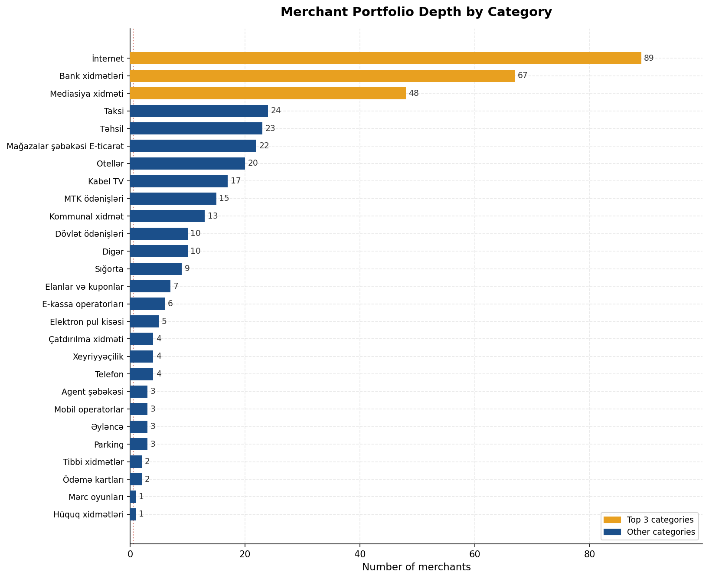
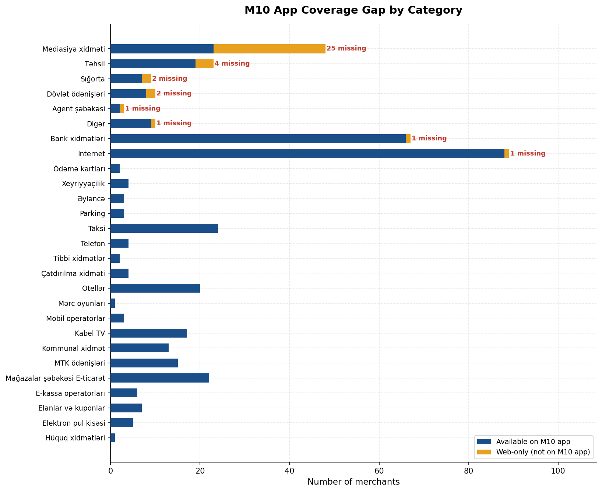
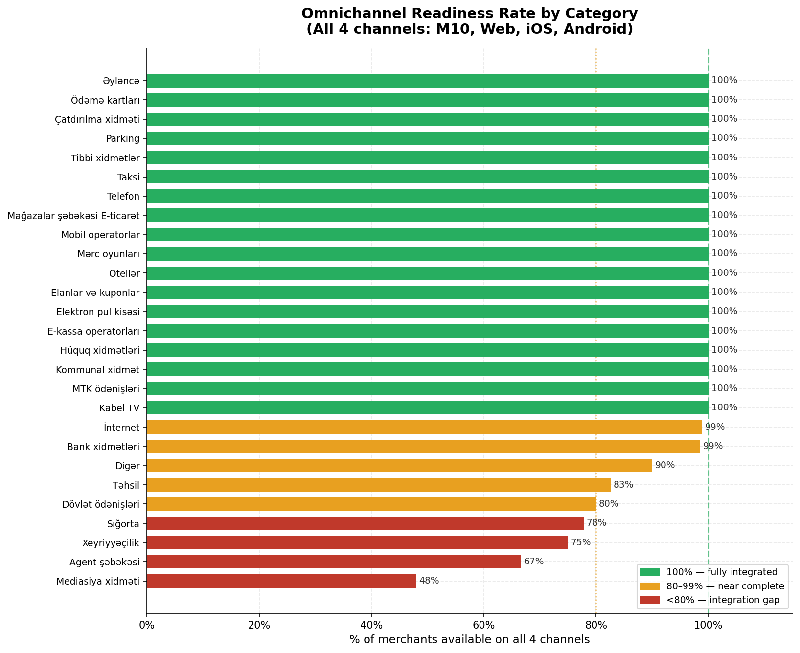
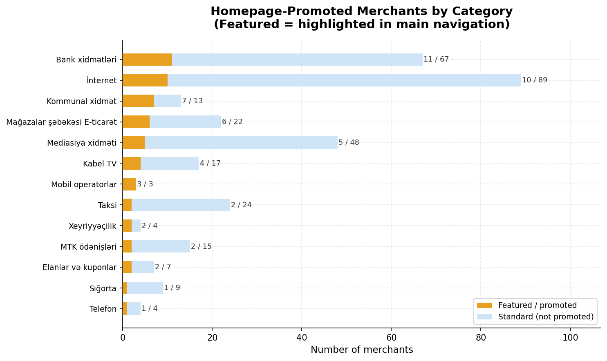
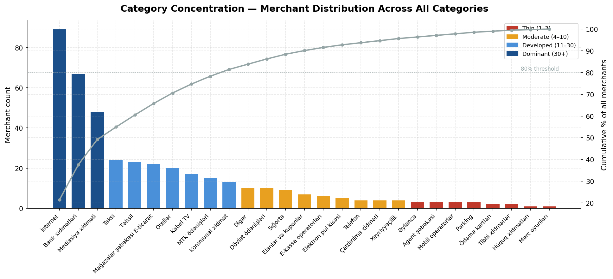
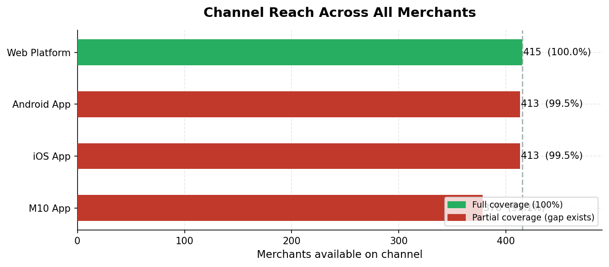

# Million.az Platform — Business Intelligence Report

> - **Audience:** Executive leadership, product owners, business development
> - **Data source:** million.az live merchant catalogue — 415 merchants across 27 active categories
> - **Purpose:** Strategic review of platform breadth, channel readiness, and growth opportunities

---

## Executive Summary

The Million.az platform hosts **415 merchants** across **27 active service categories**. The platform demonstrates strong omnichannel discipline — **91% of all merchants are simultaneously available across all four customer touchpoints** (web, M10 app, iOS, and Android). However, a concentrated set of structural gaps limits the platform's full potential: one category is entirely empty, 37 merchants are invisible to M10 app users, and over half of all merchants are confined to just three categories, leaving large parts of the catalogue underdeveloped.

---

## Finding 1 — The Portfolio Is Dominated by Three Categories

**What the chart shows:** The number of merchants registered under each service category, ranked from smallest to largest.

The top three categories — **Internet (89), Banking (67), and Mediation (48)** — collectively account for **49% of all merchants on the platform**, while the remaining 24 categories share the other half. At the opposite extreme, six categories hold only **1–2 merchants** each, making them effectively monopolies with no competitive alternatives for customers.

**Why this matters:**
- A platform with limited choice per category offers little reason for customers to return. When a user's only Internet provider option is one or two names, there is no loyalty — only obligation.
- Heavy concentration in Banking and Internet signals where commercial relationships are strongest, but also where the platform is most exposed if key partners exit.
- Thin categories (Legal Services, Entertainment, Betting, Medical) represent untapped commercial opportunities where onboarding even 3–5 additional merchants would meaningfully expand the value proposition.

**Recommended action:** Prioritise merchant acquisition in underdeveloped categories. Define a minimum-viable depth target (e.g., at least 5 merchants per category) and build a pipeline accordingly.

---

## Finding 2 — The M10 App Has a Measurable Reach Gap

**What the chart shows:** For each category, how many merchants are reachable via the M10 app versus accessible only through the web.

**37 merchants (9% of the total catalogue) are invisible to M10 app users.** The gap is overwhelmingly concentrated in two categories:

| Category | Total merchants | Not on M10 |
|---|---|---|
| Mediation | 48 | **25 (52%)** |
| Education | 23 | 4 (17%) |
| Insurance | 9 | 2 (22%) |
| Government Payments | 10 | 2 (20%) |

The Mediation category is the most critical case: the majority of its merchants — regional mediation offices across Azerbaijan — are not yet integrated into the M10 app. A customer who needs to pay a mediation fee and opens the app will find only 23 of the 48 available organisations listed.

**Why this matters:**
- Mobile is the primary and growing channel for digital payments. Merchants absent from the M10 app are losing transaction volume to cash or competitor platforms.
- For regulated or government-linked services (mediation, government payments), the absence of a mobile payment path adds friction that reduces compliance and service uptake.
- The gap creates an inconsistent customer experience: a user may find a service on the web, but not on mobile — damaging trust in the platform's reliability.

**Recommended action:** Launch a targeted M10 integration sprint for Mediation and Education. These 29 missing merchants represent the highest-impact, lowest-effort channel expansion available today.

---

## Finding 3 — Omnichannel Readiness Is Strong but Uneven

**What the chart shows:** The percentage of merchants within each category that are available on all four channels simultaneously (web, M10, iOS, Android).

**19 of 27 categories (70%) have achieved 100% omnichannel integration** — every merchant visible on one channel is visible on all. This is a strong platform discipline baseline.

The outliers tell a different story:

- **Mediation (48%)** — the weakest performer. Nearly half its merchants are web-only, making it the single largest drag on platform-wide omnichannel completeness.
- **Agent Network (67%)** and **Charity (75%)** — smaller categories but with notable gaps, worth monitoring as volume grows.
- **Government Payments (80%) and Education (83%)** — near-complete, with a small but addressable number of holdouts.

**Why this matters:**
- Customers do not distinguish between channels — they expect the same catalogue everywhere. Any merchant absent from one channel is a failed transaction waiting to happen.
- Omnichannel completeness is a prerequisite for platform-wide marketing. Campaigns that drive mobile app adoption lose impact if significant catalogue gaps remain on mobile.

**Recommended action:** Establish a public-facing internal KPI: "% of merchants at 100% omnichannel." Set a target of 97%+ within the next planning cycle. The fix is narrowly scoped — fewer than 40 merchants need attention.

---

## Finding 4 — The Fines Category Is Empty: A Strategic Blind Spot

One of the 28 declared categories — **Cərimələr (Fines)** — exists in the platform navigation but contains **zero merchants**. Customers who navigate to this category encounter an empty screen.

**Why this matters:**
- Traffic fines and administrative fines are among the highest-frequency, highest-urgency payment needs for citizens. In comparable markets, this category consistently drives significant transaction volume.
- An empty category actively damages user trust: it signals that the platform is incomplete or unmaintained.
- Competitors who offer fine payment (e.g., directly through government portals, other payment apps) gain habitual users simply because Million.az does not cover the use case.

**Recommended action:** Either activate the Fines category through government API integrations (e.g., traffic police, tax authority) or remove it from navigation until it is ready. The current state — visible but empty — is the worst possible outcome.

---

## Finding 5 — Promotional Slots Are Concentrated in the Largest Categories

**What the chart shows:** Which categories receive homepage/navigation promotional placement, and how many of their merchants are featured versus standard-listed.

**Only 13 of 27 categories have any featured merchants at all.** Banking leads with 11 featured spots, followed by Internet (10) and Utilities (7). Fourteen categories receive zero promotional exposure — their merchants appear only in the standard catalogue list.

**Why this matters:**
- Homepage placement directly drives transaction discovery and volume. Categories with no promotion are structurally disadvantaged — customers may not even know the service exists on the platform.
- The promotional allocation appears to mirror category size rather than strategic priority. Smaller but high-value categories (Insurance, Taxi, Hotels) have commercially meaningful merchants receiving no featured treatment.
- If promotional slots are sold or negotiated with partners, this is an unrealised revenue opportunity in 14 categories.

**Recommended action:** Review the promotional placement policy. Consider a "category spotlight" rotation that surfaces newer or underdeveloped categories to drive awareness and merchant acquisition signals.

---

## Finding 6 — The Platform Has a Healthy Core but a Long Tail Problem

**What the chart shows:** Merchant counts across all categories, ordered from largest to smallest, with a cumulative coverage line showing how quickly the top categories account for the full catalogue.

The top **5 categories alone account for over 60% of all merchants**. The bottom 10 categories together represent less than 10% of the total catalogue.

This pattern — a dominant core and a long, thin tail — is typical of platforms in early or mid-growth stages. It is not a crisis, but it points to where growth investment is most needed.

**Four maturity tiers emerge:**

| Tier | Categories | Merchant range | Business reading |
|---|---|---|---|
| Dominant | 3 | 30+ merchants | Deep, competitive, high-volume |
| Developed | 7 | 11–30 merchants | Healthy but can grow further |
| Moderate | 8 | 4–10 merchants | Underserved, expansion opportunity |
| Thin | 9 | 1–3 merchants | Monopoly risk, low customer value |

**Why this matters:**
- The 9 "thin" categories are portfolio liabilities. Single-merchant categories offer no customer choice and create dependency on a single partner relationship. One partner exit empties a category entirely.
- The 8 "moderate" categories are the highest-return investment zone — they already have a foundation, and incremental merchant additions have outsized impact on category value.

**Recommended action:** Use this tier framework in quarterly business reviews to track portfolio development. Set a strategic goal to eliminate the "Thin" tier within 12–18 months.

---

## Finding 7 — Platform Channel Reach Is Nearly Universal

**What the chart shows:** How many of the 415 total merchants are reachable on each of the four platform channels.

| Channel | Merchants reachable | Coverage |
|---|---|---|
| Web | 415 | 100% |
| iOS App | 413 | 99.5% |
| Android App | 413 | 99.5% |
| M10 App | 378 | **91.1%** |

Web and the two native mobile apps are effectively complete. The M10 app is the only channel with a meaningful gap — consistent with the findings in Chart 2.

**Why this matters:**
- The near-universal web and native app coverage is a platform strength. It means that infrastructure and integration processes are mature and reliable.
- The M10 gap stands out precisely because everything else is near-perfect. It is the single remediation priority from a channel perspective.

**Recommended action:** No systemic action required for Web, iOS, or Android. Focus M10 integration resources exclusively on the 37 identified merchants, prioritising Mediation (25), Education (4), Insurance (2), and Government Payments (2).

---

## Summary of Recommended Actions

| Priority | Action | Impact |
|---|---|---|
| **High** | Activate or remove the empty Fines category | Restore user trust; unlock a high-frequency payment use case |
| **High** | Integrate 25 Mediation organisations into M10 app | Eliminate the largest single channel gap |
| **High** | Merchant acquisition in thin categories | Reduce monopoly risk; increase customer choice |
| **Medium** | Review and expand promotional placement policy | Drive discovery in 14 currently invisible categories |
| **Medium** | Set and track an omnichannel completeness KPI | Maintain platform discipline as catalogue grows |
| **Low** | Define minimum merchant depth per category | Structural target for portfolio development planning |

---

*Data collected from million.az live catalogue. All figures reflect the state of the platform at the time of data collection.*
